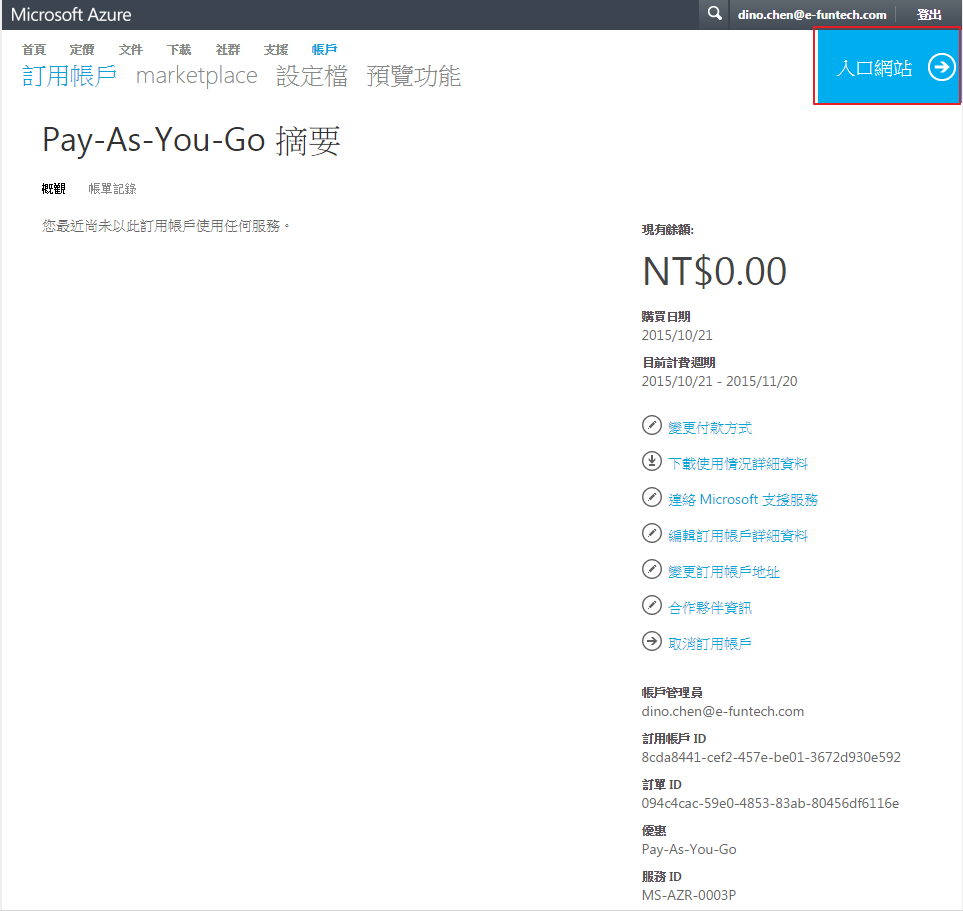
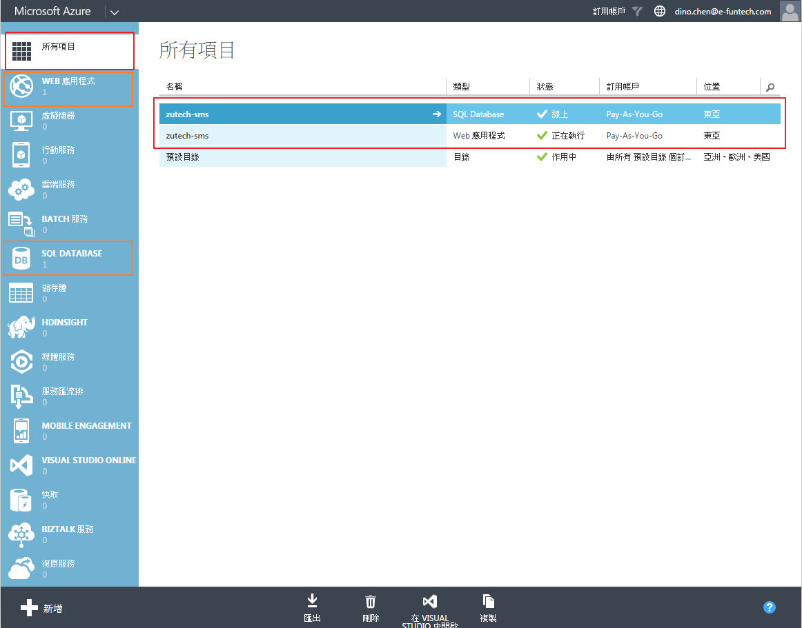
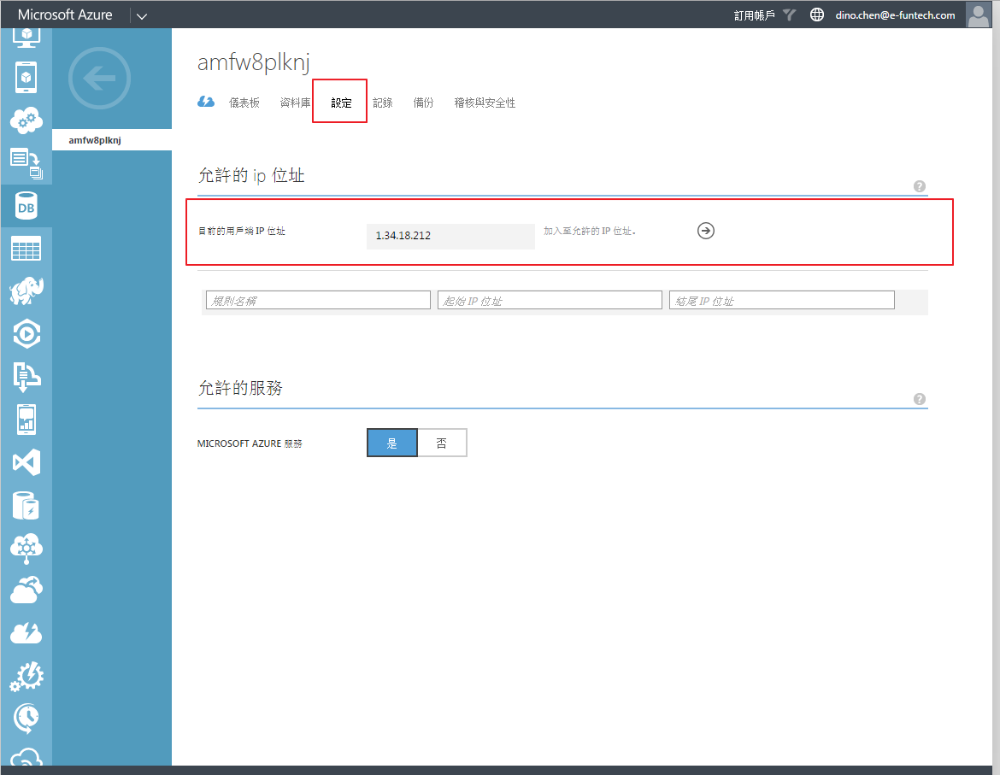

1. 入口網站



2. Azure 首頁
- 紅色部分(我們需要關注的)為所有申請服務的列表
- 橘色部分(我們需要關注的)為各別服務詳細設定



### app service
1. [網址](http://zutech-sms.azurewebsites.net/)
2. 對應網域 zutech.info

### database service
1. 連線字串
```
tcp:amfw8plknj.database.windows.net,1433;Database=zutech-sms;User ID=dino.chen@amfw8plknj;Password=P@ssw0rd;Trusted_Connection=False;Encrypt=True;Connection Timeout=30;
```
2. 資料庫資訊
	- **位址** amfw8plknj.database.windows.net,1433
	- **帳號** dino.chen
	- **密碼** P@ssw0rd

### Azure帳號密碼
Azure用之MS帳號 :
ID : dino.chen@e-funtech.com
PW : NORMANTEST123

### Kudu
https://zutech-sms.scm.azurewebsites.net

### GMAIL
Dear Norman :
 
資餘科技發信郵箱我設好了，資料與網址如下 :
 

 
登入位置 : http://mail.zutech.info‍
Mail Address : service@zutech.info
ID service
預設密碼 : 321hcetUZ
容量 : 5G
Outlook 設定方法 :
 


### 遠端連線 azure sql server

注意防火牆設定




https://azure.microsoft.com/zh-tw/documentation/articles/sql-database-manage-azure-ssms/

### Azure管理憑證設定

1. 建立pfx
https://msdn.microsoft.com/zh-tw/library/azure/gg432987.aspx
https://msdn.microsoft.com/zh-tw/library/ff699202.aspx

makecert -sv EFuntechSms.pvk -n "cn=EFuntechSms" EFuntechSms.cer -b 01/01/2015 -e 12/31/2115 -r
密碼都是：12345678

pvk2pfx -pvk EFuntechSms.pvk -spc EFuntechSms.cer -pfx EFuntechSms.pfx -po 12345678

makecert -r -pe -n "CN=EFuntechSms" -ss CA -sr CurrentUser ^
         -a sha1 -sky signature -cy authority -sv EFuntechSms.pvk EFuntechSms.cer
		 
[makecert參數說明](https://msdn.microsoft.com/zh-tw/library/bfsktky3(v=vs.110).aspx)

http://stackoverflow.com/questions/496658/using-makecert-for-development-ssl

2. 上傳憑證 pfx
選擇剛剛建立的 pfx

3. 使用憑證來發布 azure website
	- 在本地端點兩下 EFuntechSms.pfx (這樣才可以在 visual studio 找的到)
	- 在新增訂用帳戶中，
		* 選擇剛剛點兩下的憑證
		* 識別碼： 8cda8441-cef2-457e-be01-3672d930e592
		* 服務管理URL： https://management.core.windows.net
		* 命名此訂用帳戶： EFuntechSms


### 使用不同Web.config
http://kevintsengtw.blogspot.tw/2014/08/webconfig.html

### Remote Debug Azure Website
http://blogs.msdn.com/b/webdev/archive/2013/11/05/remote-debugging-a-window-azure-web-site-with-visual-studio-2013.aspx

### 自訂帳號
帳號： normansu
密碼： !QAZ@WSX

### hangfire 在 Azure 的設定

http://docs.hangfire.io/en/latest/deployment-to-production/making-aspnet-app-always-running.html?highlight=azure


https://portal.azure.com/#resource/subscriptions/8cda8441-cef2-457e-be01-3672d930e592/resourceGroups/Default-Web-EastAsia/providers/Microsoft.Web/sites/zutech-sms