簡訊平台 Migration 資料庫步驟 
=====

簡介
--------

簡訊平台，當在開發新的功能時，如果有異動資料庫 schema，必須先確保新的 schema 能夠正常運作，因此需要將 Azure 上面目前的資料庫匯入本機, 測試整個 Migration 過程是否正常，整個測試步驟如下：
	1. 匯出 Azure 資料庫
	2. 將 Azure 資料庫匯入本機的 LocalDB
	3. 對本機 LocalDB 執行 Migration，並記錄 Migration 步驟
	4. 依據步驟 3，對 Azure 資料庫執行 Migration

----------

匯出 Azure 資料庫
--------

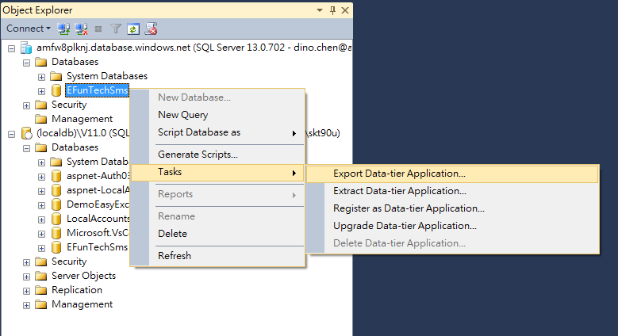
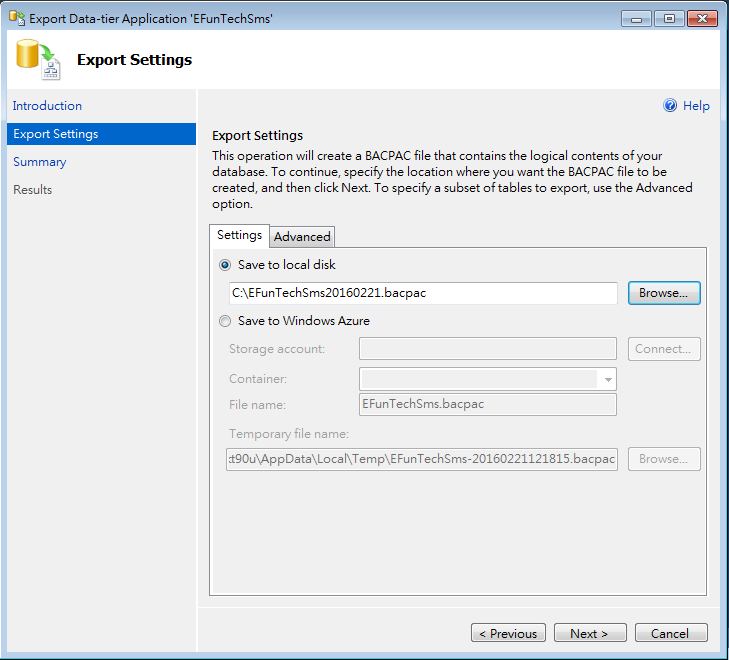
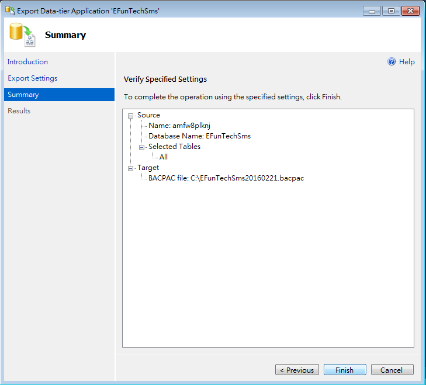
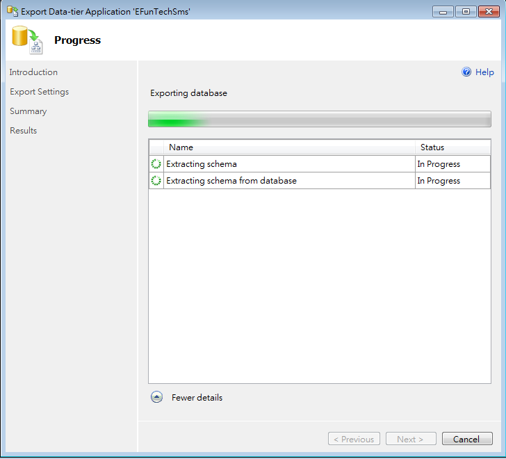
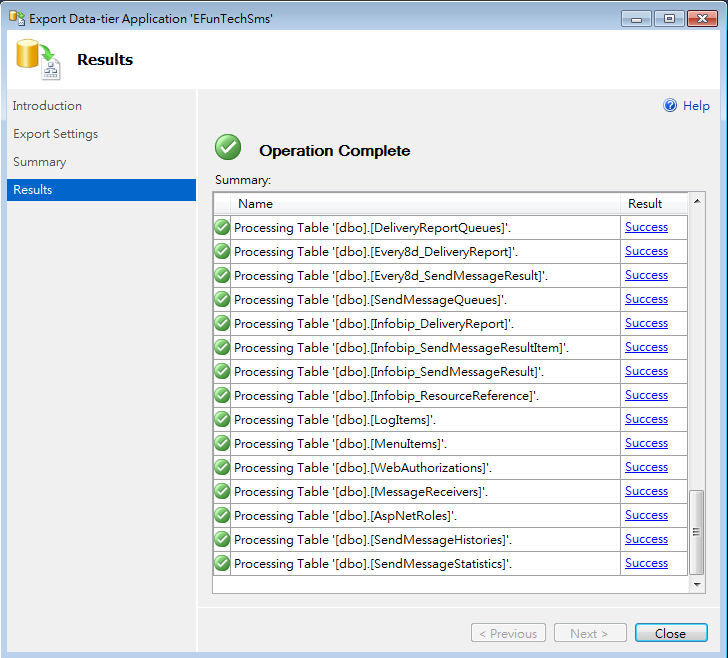

- - - -

將 Azure 資料庫匯入本機的 LocalDB
----------------------

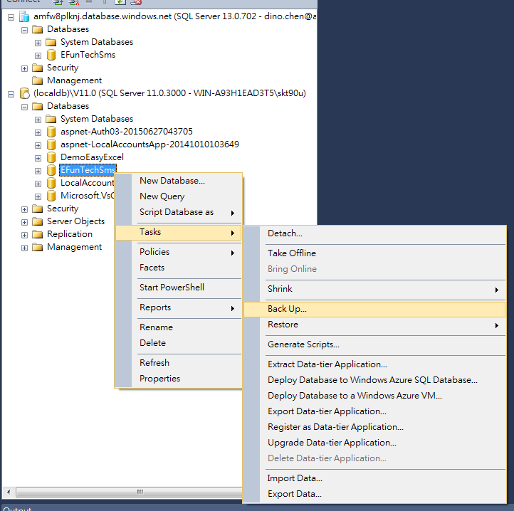
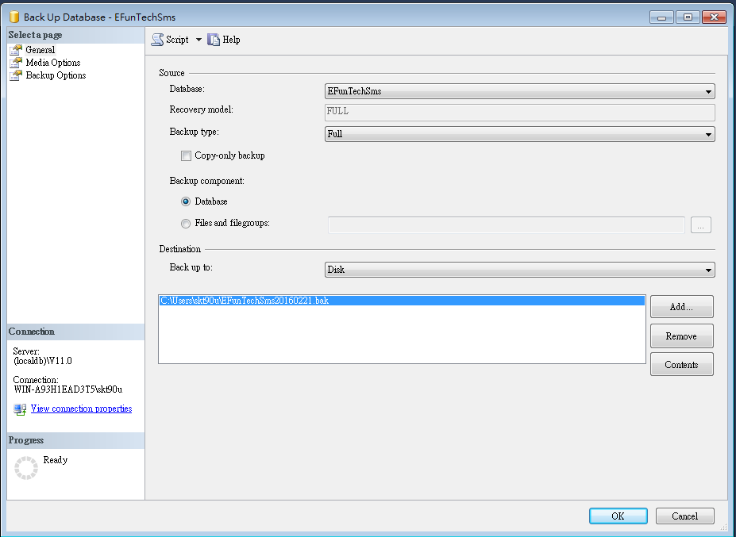
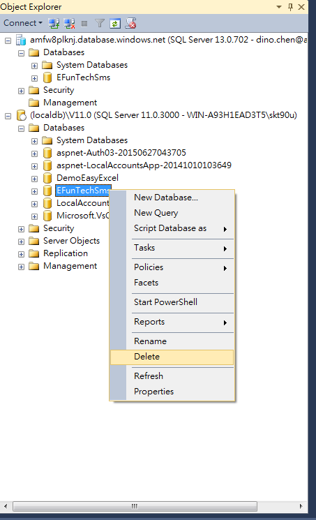
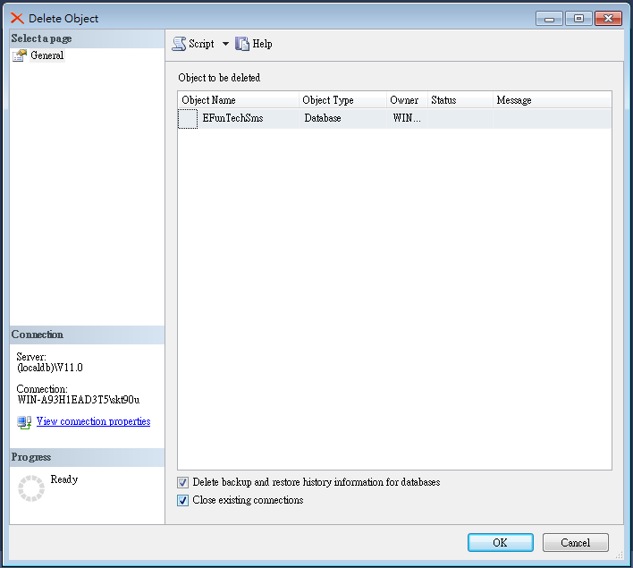
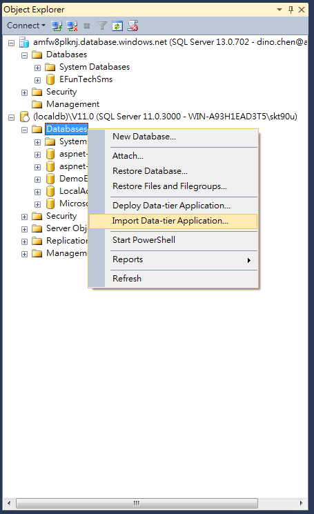
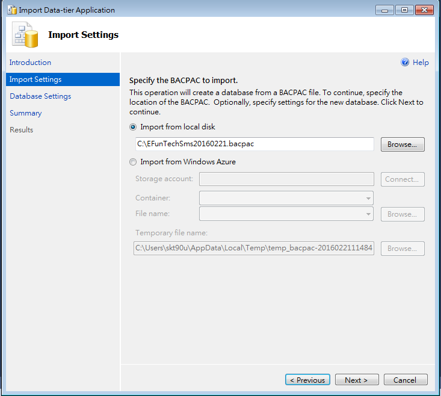
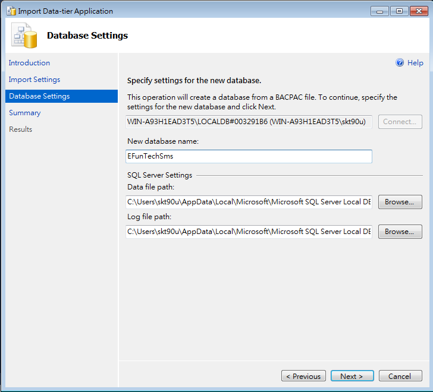
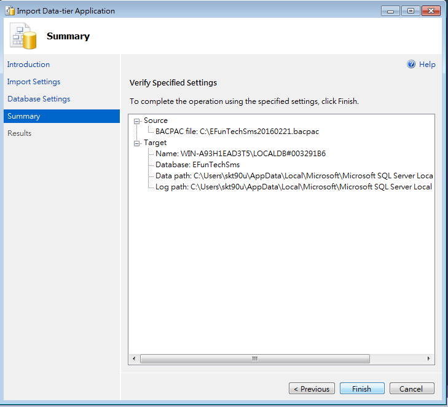
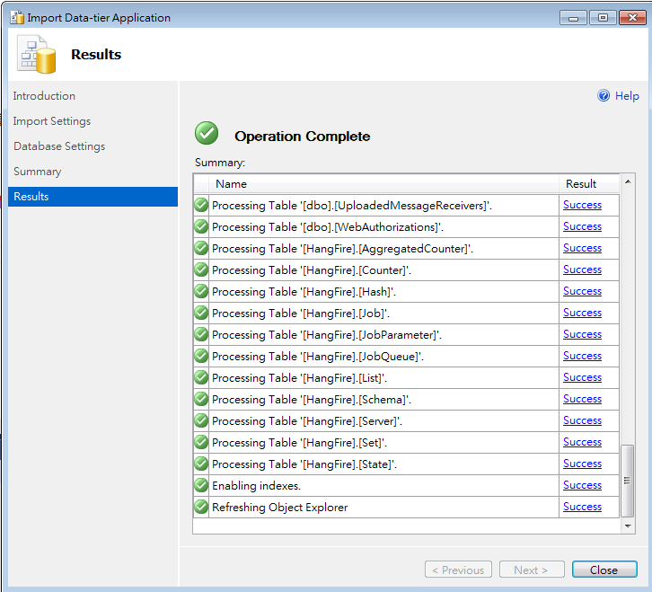

----------

對本機 LocalDB 執行 Migration，並記錄 Migration 步驟
-------

TODO

----------

依據步驟 3，對 Azure 資料庫執行 Migration
-------

TODO  

